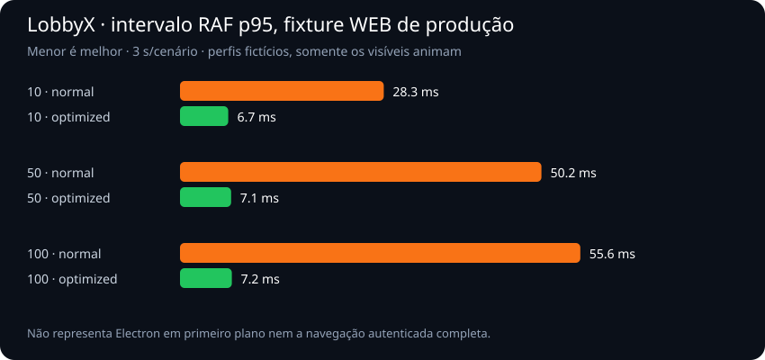

# LOBBYX — PERFORMANCE AUDIT V1

Data: 09/10/2026. Status: diagnóstico e medições; nenhuma otimização, publicação ou alteração do banco de produção foi realizada.

## Resumo executivo

O maior gargalo comprovado nesta auditoria está na contagem persistente de não lidas, preparada localmente e ainda não publicada. Com 100 usuários fictícios, 10 canais e 10 mil mensagens, a RPC executou em média 897,63 ms e atingiu p95 de 1.109,84 ms. Marcar os canais como lidos não eliminou o custo. Sob concorrência, o p95 chegou a cerca de 16,8 s, com timeouts de conexão no teste de 100 clientes SQL. Recomendo resolver esse caminho antes de publicar as notificações.

Outro resultado comprovado: vários perfis decorados perdem fluidez no modo normal. O intervalo RAF p95 ficou perto de 50–56 ms nos cenários WEB com 50/100 cards montados; no modo otimizado ficou perto de 7 ms e as escritas contínuas nos SVGs caíram para zero. Isso valida o mecanismo de redução de efeitos, mas não comprova o mesmo ganho percentual em todo o aplicativo.

Histórico paginado e lista básica de membros tiveram p95 SQL local inferior a 3 ms. Portanto, não há evidência para atribuir toda lentidão ao PostgreSQL, à região do Supabase ou à ausência genérica de índices.

As conexões de voz locais do provider real completaram nos testes, com compartilhamento sintético de vídeo e áudio. Isso não demonstra estabilidade entre redes diferentes nem mede o tempo até uma pessoa efetivamente ouvir outra. A auditoria não encontrou prova suficiente para alterar a lógica de chamadas. A configuração atual de ICE contém apenas STUN, sem TURN; isso é uma limitação de conectividade entre algumas redes, mas não comprova a causa das reconexões relatadas.

## Escopo, versões e método

- Windows 11 Pro, build 26200; Ryzen 5 4500, seis núcleos; aproximadamente 31,8 GiB de RAM física informada pelo Windows; Node 24.14.1 e Electron 44.4.5.
- Artefato Desktop: main e assets do app.asar 0.1.43. O wrapper usa o runtime Electron de desenvolvimento, perfil novo e janela oculta; bloqueia rede externa. Não mede execução do instalador, auto-update, sessão existente nem tempo exato até primeiro paint visível.
- WEB: componentes reais de moldura/indicadores, compilados com Vite em modo produção, em fixture com dados fictícios. Não é a tela autenticada completa de servidor.
- Electron: a mesma fixture compilada, janela oculta, backgroundThrottling false e mídias sintéticas. O compositor limitou RAF a aproximadamente 1 Hz, apesar de document.hidden falso. Por isso seus intervalos RAF NÃO são comparáveis à fluidez do WEB em primeiro plano.
- PostgreSQL local com todas as migrations do working tree, incluindo a de notificações não publicada. Auth/Storage/RLS emulados pelo bootstrap; sem GoTrue, PostgREST, Realtime hospedado, Vercel ou usuários reais.
- Cargas locais: 10, 50 e 100 clientes SQL concorrentes; 100 usuários fictícios; 10 mil mensagens. Isso não equivale a 100 navegadores, 100 assinaturas Supabase ou 100 pessoas na mesma chamada.
- Cinco sondagens HTTP sequenciais por host, sem chave, login ou escrita. Nenhum teste de carga foi executado contra produção.
- RNNoise: código WASM real, 6.000 frames de 10 ms, equivalentes a 60 s de áudio. A segunda execução foi feita sem concorrência de build/banco; é a utilizada no relatório.
- Medições principais executadas sequencialmente. Aplicativos habituais do computador permaneceram abertos; não é laboratório de máquina dedicada. Primeiro teste Desktop teve timeout de instrumentação e foi descartado; os sete seguintes são usados.
- p50 é mediana; p95/p99 usam nearest rank. p99 só aparece com pelo menos 100 amostras. Frames consecutivos e amostras por segundo são correlacionados; não representam sessões independentes. Percentis de 5/6/7 execuções são exploratórios.

## Metas de referência

As metas abaixo são propostas para validação em hardware intermediário e rede saudável. Não são garantias de produto.

| Operação | Excelente | Bom | Atenção | Crítico |
|---|---|---|---|---|
| Inicialização até UI utilizável | p95 ≤ 1 s | ≤ 2 s | 2–5 s | > 5 s/falha |
| Troca de servidor/canal, com cache | ≤ 100 ms | ≤ 250 ms | 250–700 ms | > 700 ms |
| Configurações/perfil já em cache | ≤ 100 ms | ≤ 200 ms | 200–500 ms | > 500 ms |
| SQL histórico/membros | p95 ≤ 10 ms | ≤ 30 ms | 30–100 ms | > 100 ms |
| SQL de contagem de não lidas | p95 ≤ 20 ms | ≤ 50 ms | 50–150 ms | > 150 ms |
| Atualização de contagem, ponta a ponta | ≤ 250 ms | ≤ 500 ms | 500–1.500 ms | > 1.500 ms |
| Mensagem/notificação recebida | ≤ 200 ms | ≤ 500 ms | 500–1.500 ms | > 1.500 ms/falha |
| Conexão de voz entre redes | ≤ 1,5 s | ≤ 3 s | 3–8 s | > 8 s/falha |
| Jitter de áudio | ≤ 10 ms | ≤ 20 ms | 20–50 ms | > 50 ms sustentados |
| Perda de pacotes de áudio | < 0,1% | < 1% | 1–3% | > 3% sustentados |
| Intervalo RAF, referência de 60 Hz | p95 ≤ 17 ms | ≤ 25 ms | 25–50 ms | > 50 ms |
| RNNoise por frame de áudio de 10 ms | p95 < 3 ms | < 5 ms | 5–10 ms ou picos > 10 ms | ≥ 10 ms sustentados |

CPU em repouso: meta de soma do percentCPUUsage Electron < 1%, sob as mesmas condições. Memória privada sem sessão: referência inicial ≤ 300 MiB; working sets somados não são RAM física exclusiva e não devem ser comparados diretamente ao total do Gerenciador de Tarefas. GPU percentual não foi medido.

## Tempos medidos

Todos os tempos são em milissegundos. SQL EXPLAIN mede execução no servidor local; testes concorrentes incluem pool, transação, configuração de papel/JWT e ida/volta loopback. NÃO são comparáveis diretamente.

| Operação/cenário | n | Média | p50 | p95 | p99 | Pior | Classificação |
|---|---:|---:|---:|---:|---:|---:|---|
| Electron 0.1.43: lançamento → did-finish-load, perfil novo | 7 | 992.29 | 970.00 | 1106.00 | — | 1106.00 | Bom; não mede UI pronta |
| history30 | 30 | 1.87 | 1.89 | 2.36 | — | 2.46 | Excelente |
| unread | 30 | 897.63 | 909.30 | 1109.84 | — | 1122.79 | Crítico |
| members | 30 | 1.53 | 1.44 | 2.23 | — | 2.44 | Excelente |
| unread-concurrent (10 clientes SQL) | 30 | 1665.88 | 1642.78 | 2286.05 | — | 2296.30 | Crítico |
| unread-concurrent (50 clientes SQL) | 150 | 7465.18 | 8163.16 | 10556.72 | 11011.09 | 11086.62 | Crítico |
| unread-concurrent (100 clientes SQL) | 268 | 9987.51 | 9654.72 | 16818.57 | 17832.93 | 18264.42 | Crítico |
| underlying-unread (authenticated) | 12 | 946.85 | 883.26 | 1224.14 | — | 1224.14 | Crítico |
| underlying-unread (postgres) | 12 | 53.46 | 51.23 | 79.31 | — | 79.31 | Controle diagnóstico |
| unread-caught-up | 30 | 899.13 | 866.14 | 1137.69 | — | 1237.75 | Crítico |
| concurrent-insert-mention (10 emissores; pool 50) | 20 | 183.48 | 40.67 | 487.23 | — | 510.76 | Atenção: carga SQL local |
| concurrent-insert-mention (50 emissores; pool 50) | 100 | 506.37 | 203.22 | 1462.43 | 1494.42 | 1534.44 | Atenção: carga SQL local |
| concurrent-insert-mention (100 emissores; pool 50) | 200 | 113.20 | 138.57 | 163.43 | 177.05 | 181.99 | Atenção: carga SQL local |
| WEB fixture: atualização 10 perfis (normal) | 20 | 2.87 | 2.20 | 6.60 | — | 8.20 | Bom |
| WEB fixture: intervalo RAF 10 perfis (normal) | 141 | 21.16 | 22.00 | 28.30 | 33.60 | 33.70 | Atenção |
| WEB fixture: atualização 50 perfis (normal) | 20 | 7.86 | 6.65 | 14.70 | — | 18.10 | Bom |
| WEB fixture: intervalo RAF 50 perfis (normal) | 81 | 37.04 | 36.20 | 50.20 | — | 66.70 | Crítico |
| WEB fixture: atualização 100 perfis (normal) | 20 | 11.82 | 10.70 | 20.00 | — | 20.70 | Atenção |
| WEB fixture: intervalo RAF 100 perfis (normal) | 78 | 38.66 | 38.90 | 55.60 | — | 72.40 | Crítico |
| WEB fixture: atualização 10 perfis (optimized) | 20 | 1.47 | 1.40 | 2.20 | — | 2.40 | Bom |
| WEB fixture: intervalo RAF 10 perfis (optimized) | 555 | 5.41 | 5.50 | 6.70 | 8.00 | 16.70 | Excelente |
| WEB fixture: atualização 50 perfis (optimized) | 20 | 5.16 | 4.65 | 7.30 | — | 11.80 | Bom |
| WEB fixture: intervalo RAF 50 perfis (optimized) | 565 | 5.32 | 5.50 | 7.10 | 8.00 | 16.70 | Excelente |
| WEB fixture: atualização 100 perfis (optimized) | 20 | 10.39 | 9.20 | 15.00 | — | 22.00 | Bom |
| WEB fixture: intervalo RAF 100 perfis (optimized) | 567 | 5.30 | 5.50 | 7.20 | 7.70 | 11.10 | Excelente |
| WEB: conexão MeshVoiceProvider local (voice) | 6 | 423.92 | 393.10 | 602.00 | — | 602.00 | Bom; exploratório |
| WEB: conexão MeshVoiceProvider local (screen-audio) | 6 | 370.90 | 368.30 | 466.80 | — | 466.80 | Bom; exploratório |
| WEB: startScreenShare, captura sintética | 6 | 40.08 | 35.95 | 73.00 | — | 73.00 | Excelente; não é primeira imagem |
| Electron fixture: conexão voice (normal) | 6 | 526.23 | 158.80 | 2272.40 | — | 2272.40 | Bom; exploratório |
| Electron fixture: conexão screen-audio (normal) | 6 | 161.22 | 142.60 | 259.80 | — | 259.80 | Bom; exploratório |
| Electron fixture: conexão voice (optimized) | 6 | 154.97 | 151.05 | 190.20 | — | 190.20 | Bom; exploratório |
| Electron fixture: conexão screen-audio (optimized) | 6 | 127.73 | 121.95 | 201.00 | — | 201.00 | Bom; exploratório |
| HTTP sequencial lobbyx-nine.vercel.app | 5 | 376.89 | 166.52 | 1213.37 | — | 1213.37 | Gateway; n=5 exploratório |
| HTTP sequencial lnupoqtaeawwggbwgbuv.supabase.co | 5 | 48.24 | 40.60 | 72.34 | — | 72.34 | Gateway; n=5 exploratório |

### WEB: normal versus otimizado

| Cards montados | Modo | Atualização síncrona p95 (ms) | RAF p95 (ms) | Escritas de path em 3 s | Nós DOM | Heap JS final (MiB) |
|---:|---|---:|---:|---:|---:|---:|
| 10 | normal | 6.60 | 28.30 | 3312 | 339 | 12.02 |
| 50 | normal | 14.70 | 50.20 | 4608 | 1568 | 12.98 |
| 100 | normal | 20.00 | 55.60 | 4392 | 3125 | 18.41 |
| 10 | optimized | 2.20 | 6.70 | 0 | 339 | 7.47 |
| 50 | optimized | 7.30 | 7.10 | 0 | 1568 | 7.93 |
| 100 | optimized | 15.00 | 7.20 | 0 | 3125 | 10.54 |

A atualização troca os contadores de todos os cards, deliberadamente. Mede wall time do flushSync; não mede troca real de servidor, commit de cada componente ou paint posterior. O Profiler padrão fica desativado no build React de produção; seu contador de commits não foi usado como evidência. Heap JS do Chromium varia com GC e não equivale à RAM do processo. Não se pode deduzir vazamento ou economia estável de RAM dessas diferenças.

### Electron: recursos

Login sem sessão: CPU média 0.10%, p95 0.17%, pior 0.19%; memória privada média 279.22 MiB; soma de working sets média 555.78 MiB, pico 558.18 MiB; 6 processos; 35 amostras úteis. A primeira leitura de CPU de cada execução foi descartada.

| Fixture/cenário | Modo | n (1 Hz) | CPU média (%) | CPU p50 | CPU p95 | CPU pior | Pico working sets (MiB) | Processos |
|---|---|---:|---:|---:|---:|---:|---:|---:|
| visual | normal | 14 | 1.70 | 1.11 | 5.41 | 5.41 | 430.52 | 4 |
| visual | optimized | 14 | 1.15 | 0.83 | 2.74 | 2.74 | 465.74 | 4 |
| voice | normal | 13 | 6.35 | 3.80 | 36.84 | 36.84 | 644.44 | 5 |
| voice | optimized | 12 | 3.25 | 3.47 | 4.70 | 4.70 | 683.16 | 5 |
| screen-audio | normal | 11 | 4.91 | 4.51 | 6.07 | 6.07 | 685.39 | 5 |
| screen-audio | optimized | 11 | 4.35 | 4.55 | 5.63 | 5.63 | 632.19 | 5 |

A soma de CPU usa exatamente percentCPUUsage retornado por app.getAppMetrics; a API mede desde sua leitura anterior. Há custo da instrumentação. As fases incluem criação/destruição de peers; não são apenas chamada parada. Normal foi medido antes de otimizado, portanto compilação de codecs, aquecimento e GC confundem uma atribuição causal do ganho de CPU. Não anunciar uma redução percentual garantida.

Aceleradores GPU estavam habilitados nas execuções Desktop válidas. O primeiro ensaio inválido registrou software/timeout e não integra as médias. Não foi medido uso percentual ou memória dedicada da GPU. O gráfico de fluidez WEB não deve ser transferido para Electron: a janela de teste estava oculta e seu RAF foi limitado pelo compositor.

Não foi confirmado vazamento. Todos os RTCPeerConnections criados na fixture Electron terminaram fechados nos dois modos. Um teste prolongado de 30–60 min, snapshots de heap e ciclos de montagem/desmontagem ainda são necessários. Perfis fictícios montados no fim do teste permanecem intencionalmente no DOM.

## Voz, áudio e rede

Provider utilizado: MeshVoiceProvider de src/services/voice.ts, com quatro slots por peer (mic, câmera, tela e áudio da tela). Somente a sinalização foi substituída por memória; RTCPeerConnection e o pipeline de áudio são reais. ICE usa apenas candidatos locais durante o benchmark; nenhum STUN/Supabase foi acessado pela fixture.

WEB realizou 12 sessões e Electron 24 sessões (seis por combinação de voz/tela e normal/otimizado). São sessões breves. As transições registradas não contiveram reconectando. Vídeo sintético 1280×720/24 fps e segunda faixa de áudio produziram pacotes recebidos e frames decodificados. Não houve captura do microfone ou tela reais, nem teste de reconhecimento de fala.

Os dados de getStats estão nos JSONs: inbound-rtp com packetsReceived, packetsLost, jitter, jitterBufferDelay e framesDecoded; candidate-pair com RTT. As amostras locais tiveram perda zero e jitter baixo, mas isso não é latência de voz real. O campo totalAudioEnergy recebido ficou zero em parte dos ensaios; não use estes ensaios como prova de áudio efetivamente ouvido. No Electron final, media-source registrou energia de entrada e AudioContexts running. Captura, decodificação, saída no alto-falante e percepção do usuário não foram cronometradas ponta a ponta.

RNNoise: carga 58.63 ms; média por frame 2.06 ms; p95 4.04 ms; p99 7.51 ms; pior 29.59 ms; custo equivalente a 15.57% de um núcleo para 60 s de áudio. Classificação: Atenção pelos picos acima do orçamento de 10 ms, embora o p95 esteja dentro da meta Bom.

A redução de ruído branco sintético foi 31.56 dB. FIFO: 10.67 ms; atraso estimado por correlação da fala limpa: 30.65 ms. Não são latência de conversa, teste de inteligibilidade humana ou estatística de microfone real. O benchmark Node/WASM exclui agendamento do AudioWorklet, Opus e rede.

### Limite estrutural do mesh — modelo, não resultado de carga

| Pessoas na mesma sala | Peers por cliente | Links bidirecionais na sala | RTCPeerConnections totais (duas pontas) |
|---:|---:|---:|---:|
| 10 | 9 | 45 | 90 |
| 50 | 49 | 1.225 | 2.450 |
| 100 | 99 | 4.950 | 9.900 |

Fórmulas: n−1 peers por cliente; n(n−1)/2 links. Não foram abertas salas mesh de 50/100 pessoas. O custo de uplink, RTP, decodificação e detecção de fala cresce com os participantes. Para salas grandes, avaliar SFU em estudo separado; nenhuma troca de arquitetura foi aplicada.

### Região e sondagens HTTP

O domínio novo do Supabase respondeu pelo edge GRU. Cinco respostas unsigned do health foram 401 esperados, pois não foi enviada API key. Isso mede gateway/TLS/conexão, não consulta SQL autenticada, Auth Google ou região física do PostgreSQL. A região de São Paulo informada no histórico não foi confirmada no painel de infraestrutura durante esta auditoria.

O site respondeu 200 nas cinco sondagens. A primeira levou aproximadamente 1,21 s e as demais cerca de 154–185 ms. A amostra não separa DNS, TLS, aquecimento de conexão, edge e servidor; não comprova cold start de Vercel. Não é tempo até UI interativa.

## Supabase, banco, mensagens e notificações

O EXPLAIN do corpo da RPC de não lidas examinou blocos de mensagens por canal com Bitmap Heap Scan e verificações de has_channel_permission; a autenticação/RLS é executada para as linhas candidatas. A comparação diagnóstica do MESMO SQL foi aproximadamente 947 ms como authenticated contra 53 ms como postgres no banco fictício. Isso isola parte importante do custo de autorização, sem provar que uma simples troca para SECURITY DEFINER seria segura. Nenhuma política foi relaxada.

A consulta de histórico usa messages_channel_created_idx e ficou abaixo de 3 ms no p95. Há índices equivalentes para privados, membros por servidor/usuário e reações por mensagem. Não foi comprovada necessidade de um índice novo para esses caminhos. Lista de membros de 100 pessoas é pequena demais para extrapolar milhares de membros.

Cargas de leitura: 30/150/268 requisições concluídas para 10/50/100 concorrentes. No último cenário houve 32 CONNECT_TIMEOUT de 300 tentativas, com timeout de conexão de 10 s. São limites do pool/host/PostgreSQL local sob essa carga; não demonstram quota ou defeito do Supabase hospedado.

Cargas de escrita com menção: 20/100/200 inserts autenticados para 10/50/100 emissores, pool limitado a 50, com RLS, validações, XP e triggers ativos; nenhum erro. A fase de 100 emissores foi mais rápida que a de 50 por aquecimento/condições do ensaio. Não afirmar melhora com mais usuários nem capacidade linear. Esses tempos são commit SQL, não envio até recebimento no outro cliente.

Entrega Realtime, menção toast/OS, presença e sincronização WEB↔EXE NÃO foram cronometradas contra um projeto de testes hospedado. Os 200 ms de agrupamento de não lidas são um limite deliberado no código, não uma medição da latência total. Atrasos de reconexão e eventos duplicados foram avaliados no código e testes existentes, sem uma campanha de falhas WAN.

## Dez pontos prioritários

| # | Evidência / arquivos e funções | Efeito e causa | Prioridade / complexidade | Recomendação |
|---:|---|---|---|---|
| 1 | MEDIDO: migration 20261010010000_persistent_unread_badges.sql, get_server_unread_counts; use-unread.ts | Contagem varre histórico e paga autorização por linhas; até zero pendentes mantém ~0,9 s; invalidação frequente agrava | P0, alta confiança, média/alta | Redesenhar agregação incremental ou leitura por canais previamente autorizados; validar EXPLAIN e isolamento de permissões. Resolver antes de publicar notificações |
| 2 | MEDIDO: FlamingCutFrame.tsx draw/ribbon; IllustratedFrame.tsx; illustrated-frames.css | Várias molduras visíveis produzem milhares de alterações de path e efeitos simultâneos; RAF WEB p95 > 50 ms | P1, alta confiança na fixture, média | Orçamento de efeitos por área visível; reduzir custo de ribbon/glow e compartilhamento de render; preservar arte e modo estático |
| 3 | ESTÁTICO: use-voice.tsx sync/occupancySweep/Global VoiceContext | setParticipants com novo objeto a cada sweep de 2 s pode atualizar todos os consumidores mesmo sem mudança | P1, média, média | Igualdade por conteúdo/versão, separar ocupação, mídia e estado de fala; medir renders reais e testar todos os cenários de entrada/saída antes de alterar |
| 4 | ESTÁTICO/MODELO: voice.ts MeshVoiceProvider, peers, detectRemoteSpeaking | Mesh e análise por peer crescem com n; detecção local/remote executa em RAF; Modo Desempenho visual não reduz esse áudio | P1 para escala, alta no desenho, alta para SFU | Definir limite operacional medido para sala; estudar SFU para salas grandes. Não trocar transportes nesta etapa |
| 5 | ESTÁTICO: messages.ts send/hydrate; use-messages.ts; equivalentes DM | getUser antes do insert; depois perfis, replies, autores de replies e reações em etapas; origem local e Realtime podem hidratar a mesma mensagem simultaneamente | P1, média, média | Cache de perfis/replies, coalescer hidratação por ID e paralelizar dependências independentes; manter validação/auth backend |
| 6 | ESTÁTICO: use-social.ts useConversations/useFriends; use-gamer.ts useGamePresenceMap | Cada evento pode refazer listas inteiras; MemberPanel e VoiceRoom criam assinaturas distintas da mesma presença de jogo | P1, média, média | Cache compartilhado e atualização incremental; debounce por domínio; filtrar assinaturas conforme permissões |
| 7 | ESTÁTICO: router.tsx; use-auth.tsx; _authenticated/route.tsx; use-servers.ts | QueryClient sem políticas de staleTime; beforeLoad consulta usuário/perfil enquanto AuthProvider consulta perfil; SIGNED_IN invalida tudo | P1, média, baixa/média | Política específica de cache e deduplicação de sessão/perfil. Confirmar requests cancelados/repetidos em trace autenticado |
| 8 | ESTÁTICO: ChatView.tsx e DirectChatView.tsx map; MemberPanel.tsx groupMembersByRole; members.ts listByServer | Histórico acumula páginas no estado; listas não virtualizadas; membros sem paginação e junção de roles com filter por membro | P2, média, média | Janela/paginação e virtualização preservando scroll, foco, menus e acessibilidade; indexar junções em Map no cliente se medições justificarem |
| 9 | ESTÁTICO: gamer.ts publicProfileService.load; QuickProfile.tsx; assets illustrated | Perfil dispara seis consultas; hover tem espera intencional de 320 ms; nove assets completos + compactos somam ~3,56 MiB | P2, média, média | Cache/RPC de perfil, carregar somente cosmético escolhido e imagens no tamanho adequado; medir decode. Não remover o atraso de hover cegamente |
| 10 | MEDIDO + ESTÁTICO: RNNoise WASM/audio-processing.ts; desktop/main.cjs backgroundThrottling false | DSP tem picos locais de ~30 ms; janela oculta preserva trabalho de áudio e timers. Nem todo trabalho deve ser suspenso | P2, média, média/alta | Profile AudioWorklet real e tarefas visuais ociosas separadamente; suspender efeitos sem pausar áudio; garantir fallback e não mudar supressão sem teste auditivo |

A ordem combina impacto, evidência e risco. Os itens estáticos são candidatos, não bugs confirmados em produção. Esta auditoria não estabelece causa definitiva das reconexões antigas.

## Inventário de renderização, cache e Realtime

- useChannelMessages tem uma assinatura por canal, mas o estado de mensagens não é cacheado entre canais. Voltar refaz list + hydrate. Paginação usa páginas de 30; não há janela máxima de histórico montado.
- MessageItem já utiliza memo. Entretanto onReact é uma função nova por mensagem em cada render de ChatView; a comparação rasa pode perder o benefício. Não foi medido o número exato de renders no app autenticado.
- useServerCategories invalida categorias e canais ao assinar, mesmo após o carregamento inicial. Há handlers gerais e específicos de DELETE que podem provocar invalidação repetida. Precisa de trace antes de correção.
- Presença global, calls:presence, inbox de chamadas, social, menções e observação de voz têm tópicos separados. Tópicos não equivalem a WebSockets independentes: normalmente compartilham o cliente Supabase. Não classificar toda assinatura como desnecessária.
- PublicProfile e relacionamentos são carregados quando a prévia abre; jogos têm staleTime de cinco minutos. Mecanismo de molduras já compartilha IntersectionObserver; Corte Flamejante compartilha clock de 30 fps; preferência reduz movimento e pausa visuais fora da tela/ocultos.
- O sweep de voz de 2 s é local, não um polling HTTP. Os heartbeats e backoffs existentes protegem ocupação/conexão; não removê-los indiscriminadamente.
- PRIVATE REALTIME permanece desativado por padrão no estado atual. Esta auditoria não mudou essa configuração nem misturou testes sintéticos com tópicos de produção.

Documentação consultada: [Electron CPUUsage](https://www.electronjs.org/docs/latest/api/structures/cpu-usage) e [MemoryInfo](https://www.electronjs.org/docs/latest/api/structures/memory-info) definem os contadores; [TanStack Query: foco](https://tanstack.com/query/latest/docs/framework/react/guides/window-focus-refetching) explica revalidação de consultas stale; [Supabase Postgres Changes](https://supabase.com/docs/guides/realtime/postgres-changes) documenta autorização por assinante e filtros. Essas referências fundamentam recomendações, não substituem resultados locais.

## Volume do build Desktop atual

Tamanho de arquivo e gzip calculado localmente; não é volume realmente transferido em uma navegação. Chunks são divididos e carregados sob demanda. O código-fonte com notificações preparadas é diferente do artefato 0.1.43 usado para inicialização.

| Chunk (maiores oito) | KiB bruto | KiB gzip calculado |
|---|---:|---:|
| index-C3qTpFoz.js | 402.49 | 124.11 |
| app-DLa-eunI.js | 236.24 | 59.36 |
| client-CEDR7SOw.js | 214.60 | 55.06 |
| SessionCommunications-DkohCfde.js | 76.57 | 22.83 |
| types-BAbbhTHb.js | 58.74 | 13.69 |
| select-CPCed4K7.js | 45.10 | 15.13 |
| utils-Dq0ltMZO.js | 41.03 | 13.63 |
| dist-QznMSzQ6.js | 39.96 | 14.37 |

## Operações não medidas e limitações

| Operação solicitada | Situação / motivo | Próxima validação segura |
|---|---|---|
| Tempo exato até UI inicial interativa do exe | Medimos carregamento de documento; formulário /login confirmado depois de 6 s, sem timestamp exato do primeiro paint | RUM de milestones em build de teste e execução visível controlada |
| Troca real de servidores/canais/configurações/perfil | Sem sessão autenticada fictícia integrada à fixture; somente componentes renderizados | Projeto staging e contas fictícias; trace HTTP/React com rota real |
| Download/decode de avatar/banner real | Não cronometrado; nenhum asset privado foi copiado | Amostras fictícias em storage de teste, tamanhos/formatos controlados |
| Central de Missões, Ranks e Inventário Progression V1 | Atualização arquivada por instrução anterior, fora deste build | Auditar em worktree isolada quando retomada; não restaurada |
| XP/badges atuais | Há feature básica anterior; não houve medição isolada de sua tela/RPC | Dados fictícios e eventos de XP em staging |
| Voz entre redes, captura do mic e tempo até ouvir | Sem dois dispositivos/redes/contas de teste e captura real autorizada | Coletar getStats dos dois lados por 10–30 min, registrar codec/ICE/RTT/jitter e milestones sem gravar voz |
| Internet instável/reconexão WAN | Não injetamos perda/latência na rede do usuário nem produção | Sinalização e TURN de teste; perda 1/3/5%, jitter e interrupções limitadas |
| WEB↔EXE, notificação/presença ponta a ponta | Banco local não tem Auth/Realtime hospedados | Staging com dois clientes; identificadores de correlação e clocks corrigidos |
| 10/50/100 usuários Realtime reais | Simulação local de dados, consultas e cards; não de sockets hospedados | Projeto separado com orçamento/limites definidos |
| 10/50/100 usuários na mesma chamada | Apenas modelo mesh; chamadas reais testadas com dois peers | Escala progressiva local/staging, nunca começar por 100 peers em produção |
| GPU %, RAM WEB total, leak de longo prazo | Não coletados de forma isolada/confiável | Trace de compositor e heap snapshots; sessão prolongada em máquina dedicada |

## Plano de correção e critérios de aceite

1. **P0 antes de liberar as notificações:** otimizar contagem/RLS com diagnóstico apresentado; manter mesmos resultados e permissões. Alvo SQL p95 ≤ 50 ms com 10 mil mensagens, inclusive zero pendentes; staging com 10/50/100 clientes; nenhuma exposição entre servidores. Não aplicar atalhos que contornem RLS.
2. **P1 interface, risco moderado:** reduzir custo de molduras mantendo o design; reduzir renders de contexto/listas e cache duplicado. Meta RAF p95 ≤ 25 ms com os mesmos cards visíveis, modo normal; otimizado continua estático. Avaliar Electron em primeiro plano antes de anunciar ganho.
3. **P1 mensagens/cache:** hidratação concorrente deduplicada, consultas independentes paralelas, cache com política explícita. Aceite: zero mensagem duplicada/perdida, reações/menções corretas, trace com menos requests e mensagem ponta a ponta p95 ≤ 500 ms em staging.
4. **P2 escala e mídia:** benchmark real RNNoise/worklet, virtualização e estudo SFU sem trocar chamadas existentes. Aceite inclui CPU, memória e voz sob tela+áudio, cenário parado e ciclos de troca de canal.
5. **Fechar lacunas de validação:** ambiente staging com contas fictícias e WEB/EXE em duas redes; no mínimo 30 execuções de cada operação de UI, 100 para percentis de cauda e sessões longas. Depois repetir cenário A/B com ordem alternada e hardware/versões idênticos.

Nenhuma dessas otimizações foi implementada nesta etapa. O usuário deve receber este diagnóstico antes de alterações de produção. Não houve push, release, deploy ou migration em produção.

## Reprodução e evidências

- Produção da fixture: npm exec vite -- build --config tests/audit/vite.config.mjs; servir com vite preview na porta 5193; abrir /tests/audit/index.html e Executar medições.
- Banco: testes audit/db-benchmark.mjs e db-followup.mjs usam exclusivamente 127.0.0.1:55448 e bancos lobbyx_audit_TIMESTAMP. Requer PostgreSQL local preparado pelo bootstrap. Criam dados fictícios; não aceitam URL/credenciais de produção.
- Desktop: desktop-startup.cjs mede app.asar usando perfil separado; desktop-fixture.cjs consome a fixture local. Executar com electron.exe e aguardar seu processo, sem misturar cenários CPU-bound.
- DSP: scripts/benchmark-rnnoise.mjs usa fala de teste/WASM local.
- JSONs brutos, planos EXPLAIN e estatísticas consolidadas: docs/performance-audit-v1. Scripts/harness: tests/audit. A primeira rodada Electron e o primeiro RNNoise sob concorrência foram excluídos das médias finais.
- Código de produção permaneceu com as alterações de notificações que já existiam antes da auditoria; Progression continuou arquivado. Somente testes e relatório foram acrescentados.

## Verificação dos artefatos de auditoria

- Suíte existente: 163 testes passaram, zero falhas.
- Typecheck da fixture: passou.
- ESLint dos scripts e fixture: zero erros; um aviso de Fast Refresh no harness de teste.
- Fixture compilada em modo produção e resumo visual conferido no navegador.
- Captura do resumo: docs/performance-audit-v1/summary.png.

